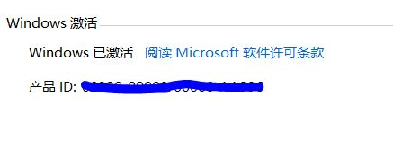
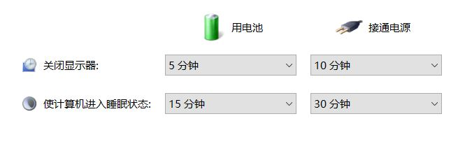
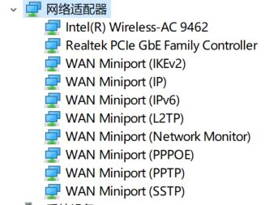
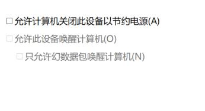
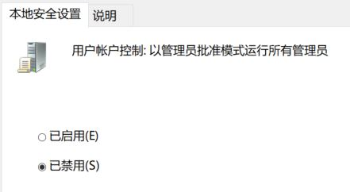
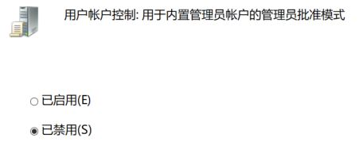
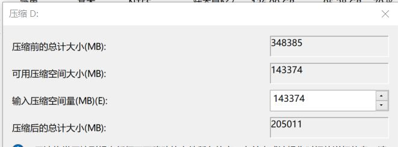
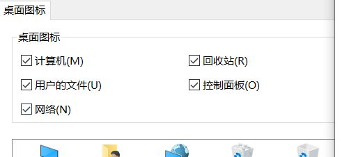

## 关于激活  
由于随机附带正版Win10专业版，在内网环境下激活可以采用无线网卡连接或手机USB网络共享连接方式进行激活，一般在连上网络的3-5分钟内会自动激活完毕。  
  

## INODE程序在电脑休眠后会断开连接  
INODE程序在休眠后会自动重连，但为了更好的客户体验，建议关闭休眠功能。  
1. 关闭休眠，开始 运行 "control powercfg.cpl" ，点击"更改计算机休眠时间"，使计算机进入休眠状态，选择"从不"  
  
2. 关闭网卡节能模式，开始 运行"devmgmt.msc" ，选择网络适配器 ，右击有线网卡，选择属性，切换到电源管理选显卡，取消勾选 "允许计算机关闭此设备以节约电源"，点击确定即可。  
  
  

## 开机Explore.exe进程假死  
目前发现部分安装AutoCad2010的计算机会出现这种情况，需要卸载AutoCad2010后正常，后期再研究解决方案。  

## 关闭UAC提示  
正版系统默认打开UAC提示，会以管理员批准方式运行需要管理员权限的程序，造成部分早期开发的程序无法正常运行，打开组策略，依次进入"计算机配置-Windows设置-安全设置-安全选项" ，分别对`用户帐户控制：以管理员批准模式运行所有管理员`和`用户帐户控制：用于内置管理员帐户的管理员批准模式`进行禁用，设置完成后重启计算机即可。  
  
  

## Win10磁盘分区  
开始运行 "diskmgmt.msc"，在需要拆分的磁盘上点右键，选择压缩卷，输入压缩空间量，即需要拆分出的空间大小，点击压缩即可。  
  

## 修改默认浏览器为IE浏览器  
Win10默认浏览器为Microsoft Edge，鉴于内网应用主要使用IE浏览器，需要修改默认浏览器为IE。  
1. 在开始菜单处点右键 ，打开设置，选择"应用"  
  
2. 点击默认应用选项卡，在右侧找到Web浏览器，点击Microsoft Edge ，选择Internet Explorer  
  
3. 添加32位 Internet Explorer快捷方式到桌面，依次打开C:\Program Files (x86)\Internet Explorer  ，右键点击 iexplore.exe 选择发送到 -桌面快捷方式即可。  
4. 设置IE浏览器默认打开的首页为 http://www.dlg.com

## 安装集团标准字体  
主要有三个：仿宋GB2312 ，楷体GB2312，华文中宋  

## 设置计算机/网络连接/用户桌面图标  
在桌面点击右键选择个性化，点击主题选项卡，打开右侧的"桌面图标"，依次勾选"计算机、回收站、用户的文件、网络、控制面板"，点击确定即可。  
  

## 卸载随机附带的杀毒和Office程序  
卸载随机附带的杀毒软件以及Office程序  

## 常用软件安装列表  
1. Adobe Reader 以及相关补丁  
2. ClassicShell 经典开始菜单插件  
3. 输入法  
4. 播放器  
5. 64位解压缩软件  
6. WPS2016招商专用版  
7. 杀毒软件  
8. E-message和Adobe Air  

## 持续更新中...  
待持续更新...  

