## Windows10打印共享设置  
针对正版Win10系统的打印设置，以下主要罗列XP与Win10间打印机设置的相关操作步骤，有不完善的地方将持续修改。  

### 一.XP系统连接Win10系统共享打印机  
XP系统连接Win10系统打印机包括以下几个步骤
#### （一） 设置Win10系统的网络区域为专用网络  
1. 这时我们右键点击桌面左下角的开始按钮，在弹出的菜单中选择"设置"菜单项。  
  
2. 这时就会打开Windows设置窗口，点击窗口中的"网络和Internet"图标。  
  
3. 在打开的设置窗口中，选择状态选项卡，再我们点击"更改连接属性"快捷链接。  
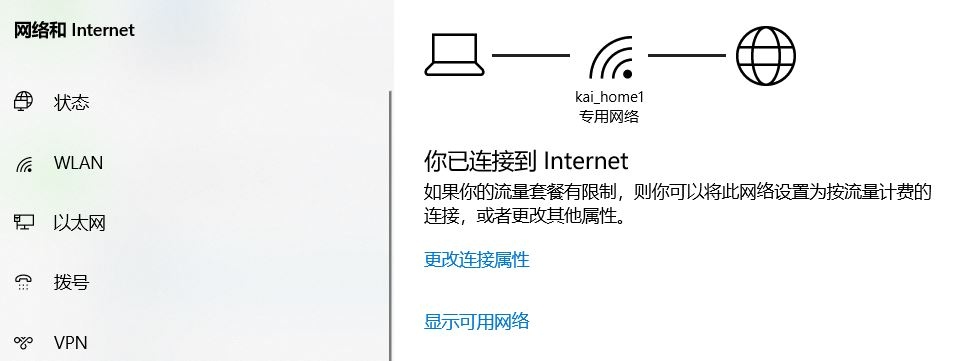  
4. 这时就会打开网络属性设置窗口，点击网络配置文件为"专用"设置项。  
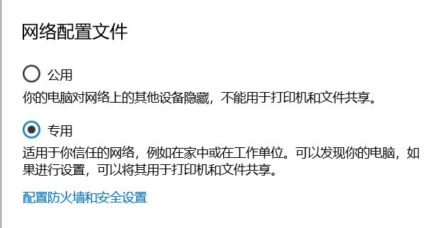  
#### （二）修改Win10系统共享方式和加密位数  
1. 打开控制面板，网络与共享中心设置，开始 运行 ，命令：control  /name Microsoft.NetworkAndSharingCenter ，弹出的窗口选择"更改高级共享设置"。  
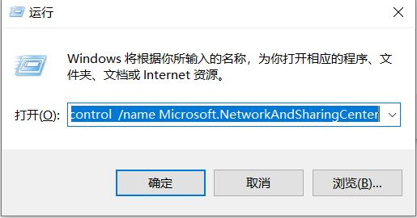  

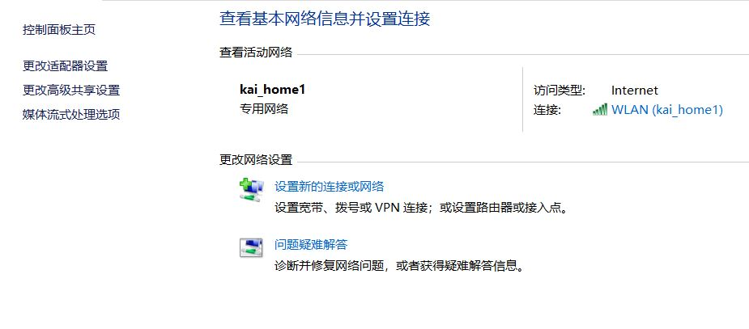  

2. 在专用连接的文件和打印机共享设置中，点选启用文件和打印机共享  
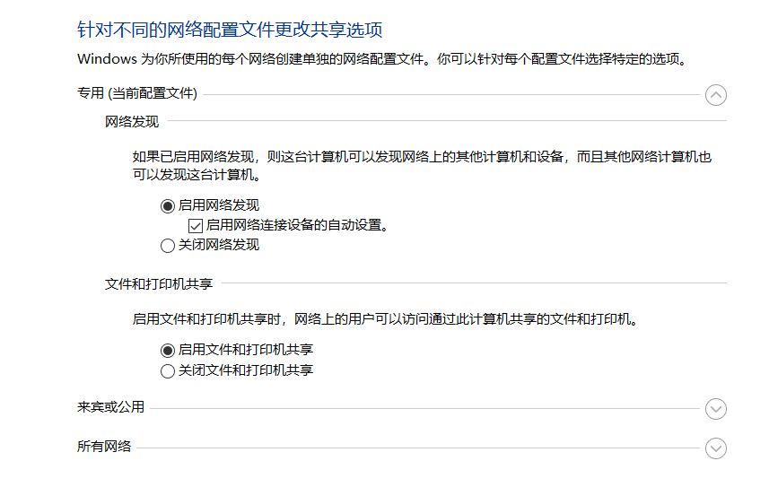  
3. 在所有网络区块，点选"为使用40或56位加密的设备启用文件共享"，点选"有密码保护的共享"  
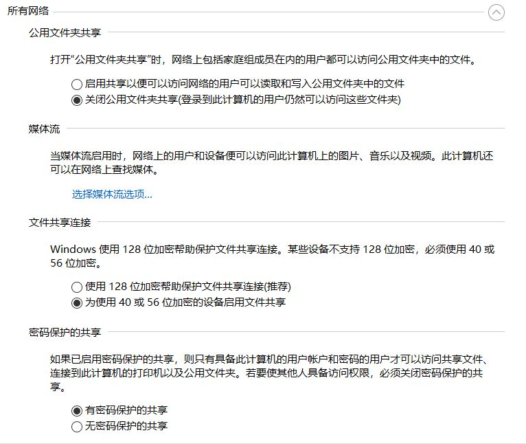  
#### （三）设置用户开机密码  
因为启用了带密码的共享，需要给用户设置开机密码，开始运行  "lusrmgr.msc"，打开本地用户和组，点击用户，选择本机登录账户，点击右键，选择"设置密码"，设置密码即可。  
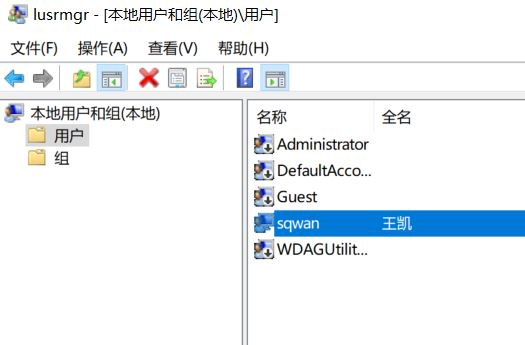  

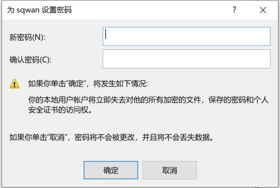  
#### （四）设置Win10打印机共享  
1. 开始运行 "control /name Microsoft.Printers" 打开设备和打印机  
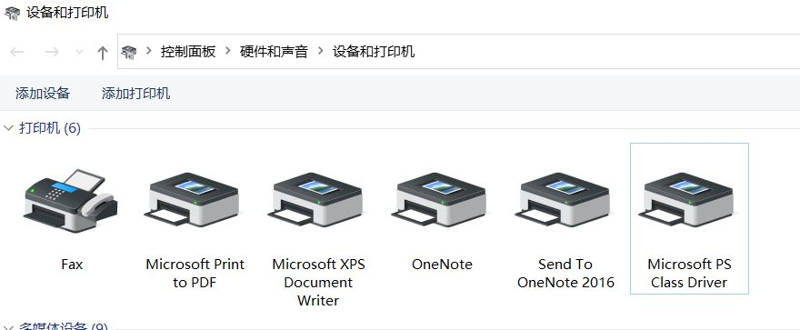  
2. 选择要共享的打印机，在其上点右键选择打印机属性，切换到共享选项卡，勾选"共享这台打印机"，再点击确定即可。  
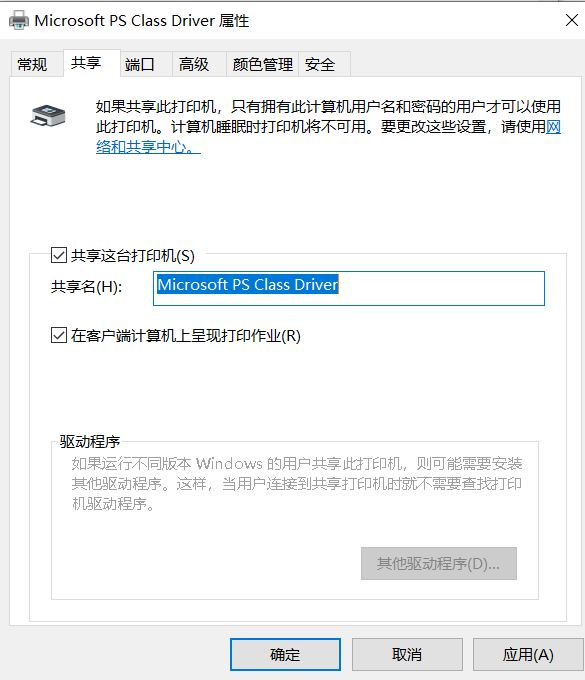  
#### （五）设置Win10 SMB1.0 共享支持  
由于Win10默认关闭SMB1.0支持，因此手动开启SMB1.0功能  
1. 开始运行 "control  /name Microsoft.ProgramsAndFeatures"  
2. 点击启用或关闭Windows功能 ，勾选"SMB 1.0/CIFS文件共享支持"，它会选中三项"SMB1.0服务器，SMB1.0客户端，SMB1.0自动删除"，服务器是Win10作为共享主机要用到的，客户端是XP系统作主机用到的。  
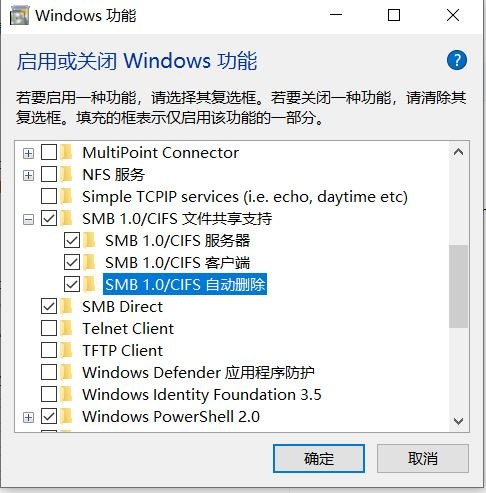  
3. 点击确定，然后重启计算机。  
#### （六）设置XP系统的登录到Win10系统的账号  
1. 因为XP默认登陆到远程计算机用的是guest或者everyone账号，因此需要修改登录账号，开始运行 "control userpasswords2"，选择高级选项卡，点击管理密码。  
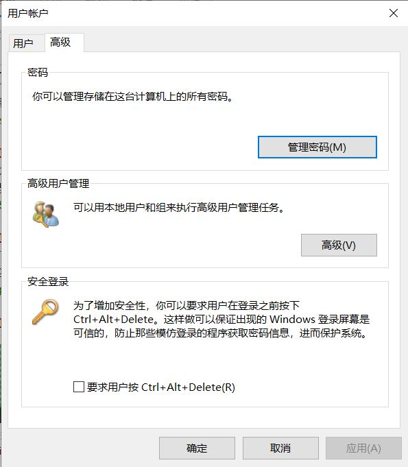  
2. 服务器地址为Win10共享打印机的计算机IP地址，用户账号要按一定格式。  
> 账号的格式是 ip\用户名  ,例：10.9.8.57\wangkai   
3. 输入密码即可。  
#### （七）XP连接共享打印机  
1. 准备好XP版本的打印机驱动程序，解压缩到XP计算机上  
2. 开始运行 "\\Win10共享打印机计算机的IP"，例如：  
> \\10.9.8.57  
3. 双击要连接的打印机，会要求选择驱动程序，这时候再安装驱动程序到最后步骤的时候会出现错误提示，"无法连接到打印机"。没关系，接着往下走。  
4. 打开XP的设备和打印机，先添加一个本地打印机，端LPT这样的端口，驱动选择刚刚我们解压缩的打印机驱动，添加成功后，进入到下一步。  
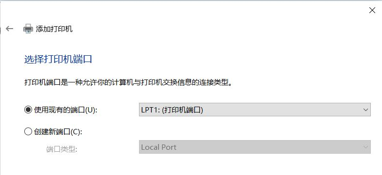  
5. 选择刚才我们添加的本地打印机，右键打印机属性，选择端口选项卡，点击添加端口，选择"Local Port"类型端口，点击新端口，输入端口名，格式如下：  
> \\Win10共享打印机计算机IP\完整的打印机共享名称
> \\10.9.8.57\Microsoft PS Class Driver  

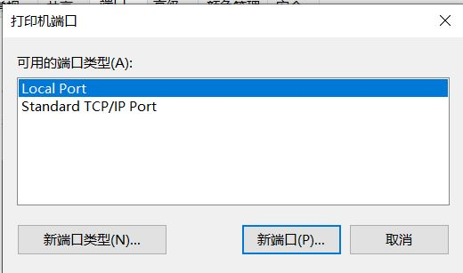  
6. 端口选择刚刚添加的那个Local Port端口，点击确定即可  

到此即可完成XP连接Win10共享打印机的操作步骤。  

### 二.Win10系统连接XP系统共享打印机  
有了上面XP连接Win10系统的操作步骤，Win10连接XP系统的共享相对容易一些。  
#### （一）设置XP打印机共享  
1. 打开XP系统设备和打印机  
  
2. 选择要共享的打印机，在其上点右键选择打印机属性，切换到共享选项卡，勾选"共享这台打印机"，再点击确定即可。  
  
#### （二）设置Win10系统的登录到XP系统的账号  
1. 开始运行 "control userpasswords2"，选择高级选项卡，点击管理密码，选择windows凭据，点击添加windows凭据  
  
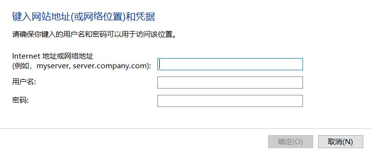  
2. 网络地址为XP共享打印机的计算机IP地址，用户名为XP电脑管理员用户名  
3. 输入密码即可。  
#### （三）设置Win10 SMB1.0 共享支持  
由于Win10默认关闭SMB1.0支持，因此手动开启SMB1.0功能  
1. 开始运行 "control  /name Microsoft.ProgramsAndFeatures"  
2. 点击启用或关闭Windows功能 ，勾选"SMB 1.0/CIFS文件共享支持"，它会选中三项"SMB1.0服务器，SMB1.0客户端，SMB1.0自动删除"，服务器是Win10作为共享主机要用到的，客户端是XP系统作主机用到的。  
  
3. 点击确定，然后重启计算机。   
#### （四）Win10连接共享打印机   
1. 准备好Win10版本的打印机驱动程序，解压缩到计算机上  
2. 开始运行 "\\XP共享打印机计算机的IP"，例如：  
> \\10.9.8.57  
>
> 3. 双击要连接的打印机，会要求选择驱动程序，选择本地解压的驱动程序进行安装即可。  

到此即可完成Win10连接XP共享打印机的操作步骤。  
### 三.其它连接问题  
#### （一）"你不能访问此共享文件夹，因为你组织的安全策略阻止未经身份验证的来宾访问"  
1.这个提示一般是Win10连接其它操作系统的共享会出现，开始 运行 "gpedit.msc"，依次进入"计算机配置-管理模板-网络-Lanman工作站节点"，双击右侧的"启用不安全的来宾登录"，勾选为`已启用`  
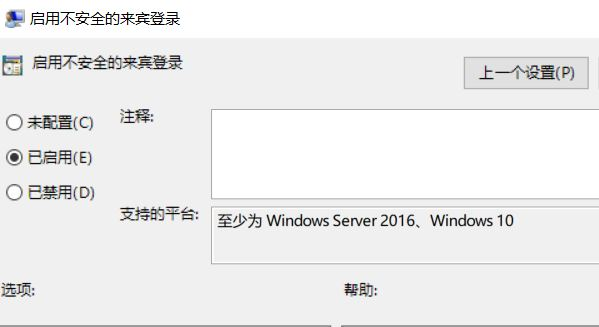  
2.重启计算机，再次连接即可  

